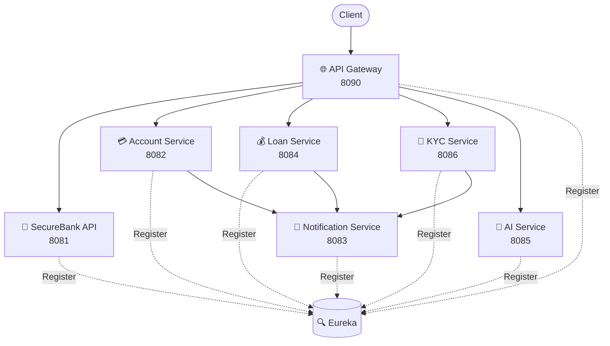
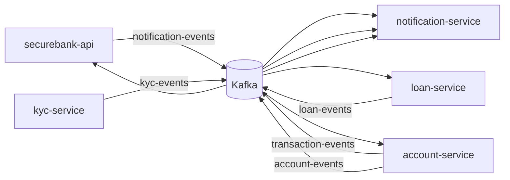
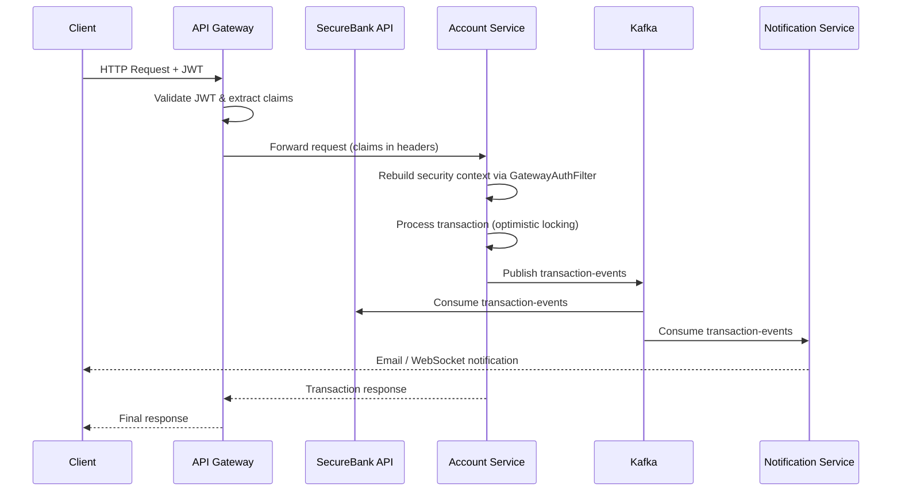
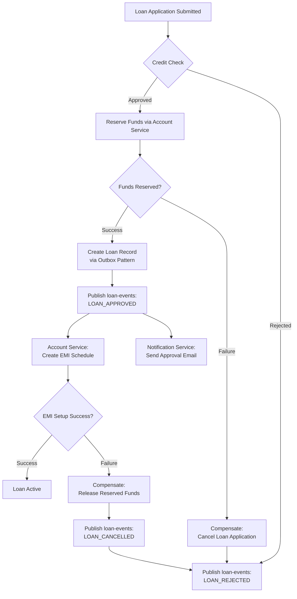
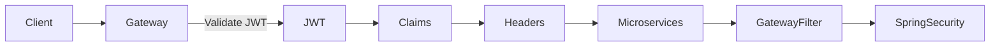
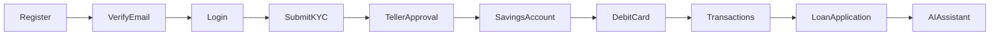

# 🏦 SecureBank

> A production-grade banking platform built using **Spring Boot 4**, **Spring Cloud**, **Kafka**, **MySQL**, and **Spring AI**, following a **Microservices Architecture**.


---

# ⭐ Project Highlights

- 🏗️ **8 independent microservices** communicating over HTTP (Feign) and Kafka, registered with Eureka for service discovery
- 🔐 **Centralized authentication** — JWT is validated once at the API Gateway, and claims are propagated to downstream services via secure headers
- ⚡ **Event-driven core** — Kafka powers async workflows for transactions, loans, KYC, and notifications
- 🔄 **Saga Choreography + Outbox Pattern** in the Loan Service for reliable, distributed transaction management without a central orchestrator
- 🛡️ **Resilience4j** Circuit Breakers and Retry policies protect service-to-service calls from cascading failures
- 🤖 **AI Banking Assistant** built with Spring AI 2 for natural-language account and loan support
- 📡 **Real-time WebSocket notifications** alongside async email delivery
- 🧩 **Database-per-service** design with Flyway-managed schema migrations for each microservice
- 🐳 **One-command Docker Compose deployment** for the entire platform, with GitHub Actions CI/CD
- ✅ **Idempotency & Optimistic Locking** guard against duplicate transactions and concurrent update conflicts

---

# 📖 Overview

SecureBank is a complete banking backend built using a distributed microservices architecture.

### Major Features

- 🔐 JWT Authentication & Authorization
- 🏦 Account Management
- 💳 Debit Card Management
- 💰 Loan Processing
- 🪪 KYC Verification Workflow
- 📧 Email Notifications
- ⚡ Event Driven Communication (Kafka)
- 🤖 AI Banking Assistant
- 📡 Real-time WebSocket Notifications
- 🐳 Docker Deployment
- ☁️ Spring Cloud Microservices

---

# 🏗️ Architecture



---

# 📦 Microservices

| Service | Port | Responsibility | Database |
|----------|------|----------------|-----------|
| 🌐 API Gateway | 8090 | Routing, JWT Validation, CORS | — |
| 👤 SecureBank API | 8081 | Authentication, Users, OTP, WebSocket | securebank |
| 💳 Account Service | 8082 | Accounts, Transactions, Cards | securebank_accounts |
| 📧 Notification Service | 8083 | Email Notifications | — |
| 💰 Loan Service | 8084 | Loans, EMI, Saga Workflow | securebank_loans |
| 🤖 AI Service | 8085 | AI Banking Assistant | — |
| 🪪 KYC Service | 8086 | KYC Verification | securebank_kyc |
| 🔍 Eureka | 8761 | Service Discovery | — |

---

# ⚡ Kafka Event Flow



---

# 🔁 System Sequence Diagram

A typical authenticated request — a customer initiating a transaction — as it flows through the platform:



---

# 💰 Loan Saga Diagram

The Loan Service uses **Saga Choreography** with the **Outbox Pattern** to coordinate distributed transactions across services without a central orchestrator, including compensating actions on failure:



---

# 🔐 Authentication Flow



---

# 👤 Customer Journey



---

# 🧩 Design Patterns

| Pattern | Used In | Purpose |
|----------|---------|----------|
| Saga Choreography | Loan Service | Distributed Transactions |
| Outbox Pattern | Loan Service | Reliable Kafka Publishing |
| Circuit Breaker | Loan → Account | Fault Tolerance |
| Retry Pattern | Feign Clients | Temporary Failure Recovery |
| Optimistic Locking | Account & Loan | Prevent Concurrent Updates |
| Idempotency | Transactions | Duplicate Request Prevention |
| Gateway Authentication | API Gateway | Centralized Security |
| Audit Logging | All Services | User Activity Tracking |

---

# 🛠 Tech Stack

| Layer | Technology |
|--------|------------|
| Language | Java 25 |
| Framework | Spring Boot 4.1 |
| Cloud | Spring Cloud |
| AI | Spring AI 2 |
| Database | MySQL 8 |
| Messaging | Apache Kafka |
| API Docs | Springdoc OpenAPI |
| Resilience | Resilience4j |
| ORM | Spring Data JPA |
| Database Migration | Flyway |
| Build Tool | Maven |
| Containerization | Docker |
| CI/CD | GitHub Actions |

---

# 📁 Project Structure

```text
securebank/
│
├── api-gateway/
├── securebank-api/
├── account-service/
├── loan-service/
├── kyc-service/
├── notification-service/
├── ai-service/
├── eureka-server/
│
├── docker-compose-kafka.yml
├── docker-compose-microservices.yml
├── init-db.sql
├── .env.example
└── .github/
    └── workflows/
        └── ci.yml
```

---

# 🔄 Service Communication

| Service | Communication |
|----------|---------------|
| API Gateway | HTTP |
| securebank-api | HTTP + Kafka |
| account-service | HTTP + Kafka |
| loan-service | HTTP + Kafka |
| notification-service | Kafka |
| kyc-service | HTTP + Kafka |
| ai-service | HTTP |

---

# 🚀 Quick Start

<details>

<summary>📦 Prerequisites</summary>

- Java 25
- Maven
- Docker Desktop
- MySQL 8

</details>

<details>

<summary>🗄️ Create Databases</summary>

```sql
CREATE DATABASE securebank;
CREATE DATABASE securebank_accounts;
CREATE DATABASE securebank_kyc;
CREATE DATABASE securebank_loans;
```

</details>

<details>

<summary>⚙️ Configure Environment</summary>

```bash
cp .env.example .env
```

Each service contains an
`application-local.properties.example`.

Copy it to

```
application-local.properties
```

and configure your values.

</details>

<details>

<summary>🐳 Start Kafka</summary>

```bash
docker-compose -f docker-compose-kafka.yml up -d
```

</details>

<details>

<summary>▶️ Start Services</summary>

```bash
cd eureka-server && mvn spring-boot:run

cd account-service && mvn spring-boot:run

cd kyc-service && mvn spring-boot:run

cd loan-service && mvn spring-boot:run

cd notification-service && mvn spring-boot:run

cd securebank-api && mvn spring-boot:run -Dspring-boot.run.profiles=local

cd api-gateway && mvn spring-boot:run

cd ai-service && mvn spring-boot:run
```

</details>

---

# 🐳 Docker Deployment

```bash
cp .env.example .env

docker-compose -f docker-compose-microservices.yml up --build
```

This starts:

- Eureka
- API Gateway
- SecureBank API
- Account Service
- Loan Service
- Notification Service
- KYC Service
- AI Service
- Kafka
- MySQL

---

# 📚 API Documentation

| Service | URL |
|----------|-----|
| Eureka | http://localhost:8761 |
| Gateway | http://localhost:8090 |
| SecureBank API | http://localhost:8081/swagger-ui.html |
| Account Service | http://localhost:8082/swagger-ui.html |
| Loan Service | http://localhost:8084/swagger-ui.html |
| KYC Service | http://localhost:8086/swagger-ui.html |

---

# 🔒 Security

- JWT authentication is performed **only at the API Gateway**.
- Gateway extracts user claims from the JWT.
- Claims are forwarded using secure HTTP headers.
- Downstream services reconstruct the Spring Security context using `GatewayAuthFilter`.
- Users with `PENDING_KYC` status can access only the KYC APIs.
- Other services reject requests until KYC verification is complete.

---

# 🔮 Future Improvements

---

# 📜 License

This project is licensed under the MIT License.